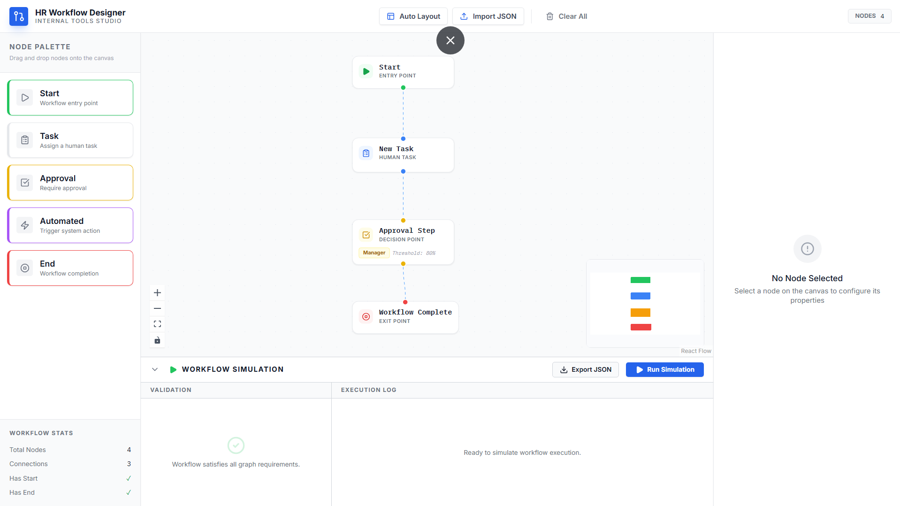
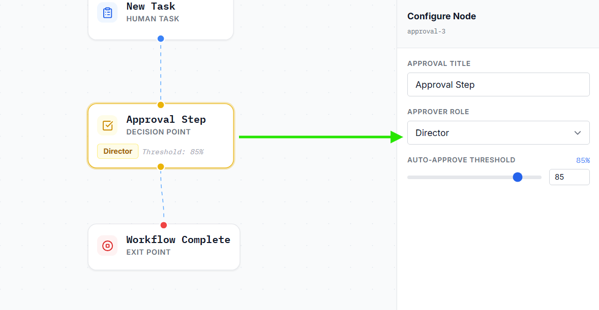
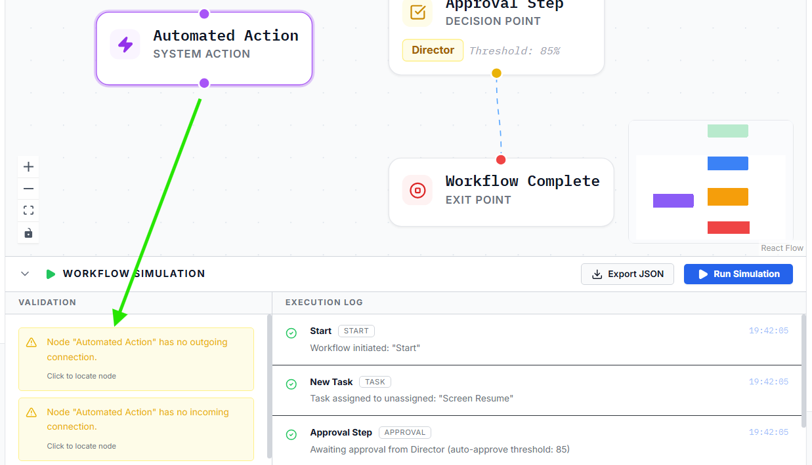
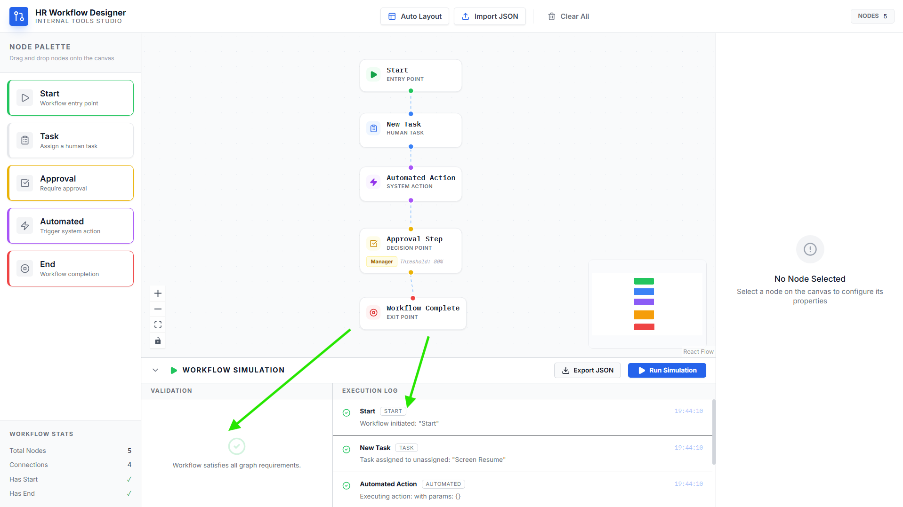
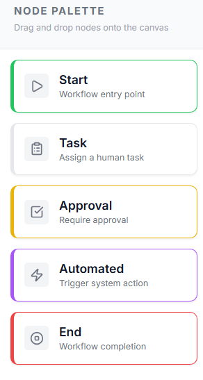

# HR Workflow Designer

A visual workflow designer built for Tredence Analytics' Full Stack Engineering Internship case study. Allows HR admins to visually construct, configure, and simulate internal workflows such as employee onboarding, leave approval, and document verification.

## Demo / Screenshots

### Main Dashboard

*A clean, light-themed interface for designing complex HR workflows.*

### Node Configuration

*Deep configuration for each node type, including assignee mapping and approval thresholds.*

### Workflow Validation

*Real-time graph validation catching unconnected nodes and invalid pathways.*

### Simulation Execution

*Step-by-step asynchronous simulation of the HR workflow with detailed logs.*

### Node Palette

*A dedicated selection of purpose-built HR workflow components.*

## Tech Stack

- **React 18**: Chosen for its robust ecosystem and concurrent rendering features.
- **TypeScript**: Strictest configuration (`"strict": true`, Zero `any` policy) to ensure early error catching, type-safe API interactions, and absolute predictability during refactors.
- **Vite 6**: Extensively fast bundler with near-instant hot module replacement (HMR).
- **React Flow (@xyflow/react)**: Fully customizable diagramming and canvas framework enabling deep node configurations.
- **Zustand**: A lightweight, unopinionated state management tool without Context API boilerplate, pairing beautifully with React Flow's graph structures.
- **Tailwind CSS v3**: Configured strictly without arbitrary shortcuts. Facilitates predictable styling directly in React components.
- **Dagre**: Provides intelligent graph auto-layout algorithms directed precisely for the workflow trees.
- **Lucide-react**: Lightweight and consistent SVG icons.

## Architecture

**Data Flow**:
- State resides in a single `workflowStore.ts` utilizing Zustand. This serves as the single source of truth allowing easy serialization of the whole workflow into JSON format.
- Node updates in the `ConfigPanel` forms push changes directly to the single store instance which forces React Flow canvas and simulation mechanisms to react simultaneously to state changes.

**Choice of State Control**:
- Zustand was chosen over Context API to prevent "Provider hell", avoid performance bottlenecks from full-tree re-renders, and seamlessly integrate state outside React components for graph validation algorithms.

**Choice of Mocks**:
- `simulate.ts` and `automations.ts` leverage local asynchronous functions over `JSON Server` for absolute zero setup, robust type-safe payload definitions, zero offline issues, and simple latency simulations (via `setTimeout`).

**Layout**:
- `src/components/` - Holds all the canvas layouts (Toolbar, SimulationPanel, ConfigPanel).
- `src/components/nodes/` - Individual custom node types.
- `src/components/forms/` - Configuration forms corresponding one-to-one with nodes.

## Running locally

```bash
git clone <repo>
cd hr-workflow-designer
npm install
npm run dev
```

## Node Types & Configuration

| Node Type | Icon | Details / Config Fields |
| :--- | :--- | :--- |
| **Start** | Play | Workflow entry point. Contains a `title` and a list of `metadata` key-value pairs. |
| **Task** | Clipboard | System task. Defines `title`, `description`, `assignee`, a `dueDate`, and `customFields`. |
| **Approval** | Check | Approval gate requiring decisions. Can assign `approverRole` (Manager/HRBP/Director) and set an `autoApproveThreshold`. |
| **Automated** | Zap | Automated trigger mapping directly to the mock API choices (`actionId`). Renders dynamic inputs for `actionParams`. |
| **End** | Stop | Exit path. Configures `endMessage` and toggles an `includeSummary` boolean flag. |

## Mock API

The designer simulates an API to handle automations and node verifications without requiring a dedicated persistent backend context.

**GET /automations**
```json
// Returns a list of dynamically configurable actions:
[
  { "id": "send_email", "label": "Send Email", "params": ["to", "subject"] },
  { "id": "create_ticket", "label": "Create JIRA Ticket", "params": ["project", "summary"] }
]
```

**POST /simulate**
Takes a payload encompassing the whole configuration map and runs BFS algorithms asynchronously over each level yielding execution traces or early failures.
```json
// Request Payload Form
{
  "nodes": [{ ... WorkflowNode ... }],
  "edges": [{ ... WorkflowEdge ... }]
}

// Response Form
{
  "success": true,
  "steps": [
    { "nodeId": "start-1", "nodeType": "start", "nodeTitle": "Init", "status": "success", "message": "...", "timestamp": "..." }
  ]
}
```

## Validation Rules

1. Must contain **exactly one** `Start` node.
2. Must contain **at least one** `End` node.
3. Every non-End node must possess **at least one outgoing connection**.
4. Every non-Start node must possess **at least one incoming connection**.
5. Workflows must be strict Directed Acyclic Graphs (**DAGs**) - absolutely no cycles are allowed in the graph configurations.

## Design Decisions
- **Custom Nodes Over Defaults:** React Flow defaults are restricted in data mapping visually — enforcing strictly modeled node components gives 100% control over visual representations (IBM Plex Mono matching).
- **Zustand Serialisation:** Makes `export as JSON` and `import JSON` structurally identical without normalization layers.
- **Discriminated TypeScript Unions:** Setting unified structures for all validation functions guarantees exhaustive configuration switches.
- **Lucide Icon Integration:** Scalable metrics.
- **Forms:** All forms are entirely controlled React states to eradicate out-of-sync behavior configurations during `SimulationPanel` actions.

## What I completed vs what I'd add with more time

**Completed**:
- All 5 custom node types mapped strictly to typed configuration forms.
- Mock API simulations mimicking asynchronous resolutions and processing flows.
- Strict Type checking ensuring exhaustive evaluations and zero `any` parameters.
- Validated DAG graph algorithms blocking infinite loops and invalid pathways.
- Export / Import logic mapped safely backwards scaling.
- Automated tree structure layout mappings algorithms.

**Would add with more time**:
- Integration with external databasing architecture (`FastAPI` backend matched to `PostgreSQL`).
- Real-time workflow edits collaboratively managed (`WebSockets`/`Yjs`).
- Complete History logging capabilities for Redo/Undo (`useUndoRedo` from ReactFlow or Zundo middleware).
- Advanced node templates.
- Branching logic conditionals allowing conditional evaluations natively within the nodes.
